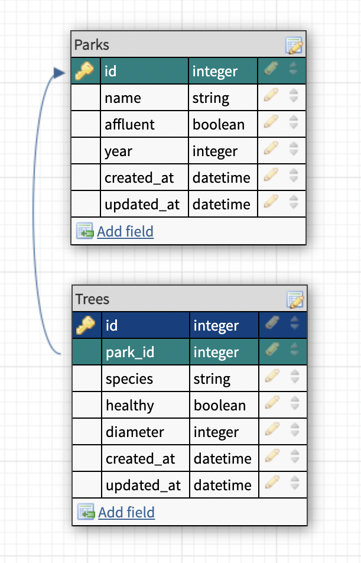

# README

## Project Requirements

* Rails version 5.2.8

* Ruby version 2.7.4

* PostgreSQL

* Handrolled routes

* All User Stories completed

* Utilize ActiveRecord

* TDD w/within blocks

* Full SimpleCov coverage

## Schema: One to Many

* Parent: Park

* Child: Tree

